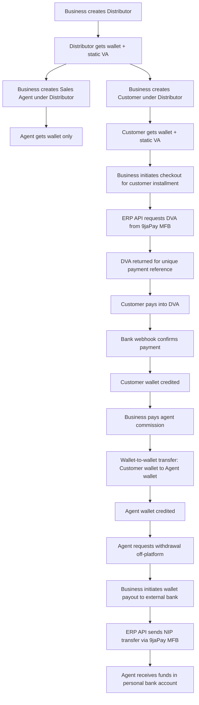
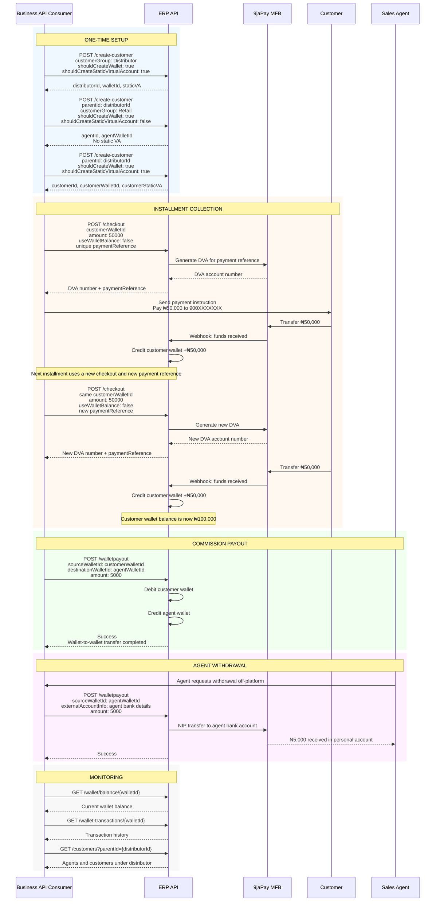
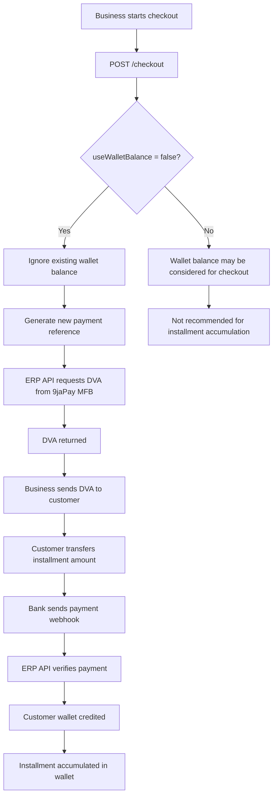
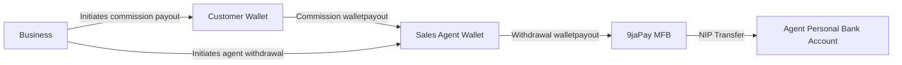

# Sales Agent Commission & Installment Collection Flow

## Overview

This flow enables businesses, such as distributors of goods or services, to:

* Organize customers and sales agents into hierarchies under distributors.
* Collect installment payments from customers through dynamically generated virtual accounts.
* Pay commissions to sales agents through wallet-to-wallet transfers.
* Allow agents to withdraw earnings to their personal bank accounts.

---

## Actors

| Actor           | Role                                                                                                                |
| --------------- | ------------------------------------------------------------------------------------------------------------------- |
| **Business**    | The API consumer, authenticated via `x-api-key`. Orchestrates all operations.                                       |
| **Distributor** | A parent entity that owns agents and customers, for example a regional branch.                                      |
| **Sales Agent** | Earns commission on sales. Has a wallet but no static virtual account. Does not receive external payments directly. |
| **Customer**    | End-user who pays for goods/services. Has a wallet and static virtual account for receiving payments.               |
| **ERP API**     | The platform API handling wallet creation, checkout, payout, wallet balances, and transaction history.              |
| **9jaPay MFB**  | Banking partner that generates dynamic virtual accounts and processes NIP transfers.                                |

---

## High-Level Flow



---

## Sequence Diagram



---

## Installment Collection Flow



---

## Commission and Withdrawal Flow



---

## Key Design Decisions

| Concern                       | Solution                                                                                                               |
| ----------------------------- | ---------------------------------------------------------------------------------------------------------------------- |
| **Installment accumulation**  | Always pass `useWalletBalance: false` on checkout. Existing balance is ignored and a new DVA is always generated.      |
| **Unique payment references** | Each checkout call must use a new `paymentReference`. Reusing one returns `"payment reference already exists"`.        |
| **Agent does not need VA**    | Agents receive commission via wallet-to-wallet transfers only. No static VA means no accidental external deposits.     |
| **Commission timing**         | The business decides when to pay commission. It could be per sale, weekly, monthly, or triggered after full payment.   |
| **Agent withdrawal**          | Agent signals the business off-platform, then the business fires `walletpayout` with the agent’s bank details via NIP. |
| **Customer payment tracking** | Customer wallet balance and transaction history show accumulated installment payments.                                 |
| **Distributor hierarchy**     | Distributor acts as the parent entity for both agents and customers.                                                   |

---

## API Calls Summary

| Step | Endpoint                                  | Purpose                              | Key Params                                                                                                   |
| ---: | ----------------------------------------- | ------------------------------------ | ------------------------------------------------------------------------------------------------------------ |
|    1 | `POST /create-customer`                   | Create distributor                   | `customerGroup: "Distributor"`, `shouldCreateWallet: true`, `shouldCreateStaticVirtualAccount: true`         |
|    2 | `POST /create-customer`                   | Create sales agent under distributor | `parentId`, `customerGroup: "Retail"`, `shouldCreateWallet: true`, `shouldCreateStaticVirtualAccount: false` |
|    3 | `POST /create-customer`                   | Create customer under distributor    | `parentId`, `shouldCreateWallet: true`, `shouldCreateStaticVirtualAccount: true`                             |
|    4 | `POST /checkout`                          | Generate DVA for installment         | `customerWalletId`, `checkoutAmount`, `useWalletBalance: false`, unique `paymentReference`                   |
|    5 | External transfer                         | Customer pays installment            | Customer transfers to generated DVA                                                                          |
|    6 | Bank webhook                              | Confirm payment                      | Bank notifies ERP API that funds were received                                                               |
|    7 | `POST /walletpayout`                      | Pay agent commission                 | `sourceWalletId`, `destinationWalletId`, `amount`                                                            |
|    8 | `POST /walletpayout`                      | Withdraw agent earnings              | `sourceWalletId`, `externalAccountInfo: { bankCode, accountNumber }`, `amount`                               |
|    9 | `GET /wallet/balance/{walletId}`          | Check wallet balance                 | `walletId`                                                                                                   |
|   10 | `GET /wallet-transactions/{walletId}`     | View transaction history             | `walletId`                                                                                                   |
|   11 | `GET /customers?parentId={distributorId}` | View distributor hierarchy           | `distributorId`                                                                                              |

---

## Example End-to-End Scenario

A distributor has one customer and one sales agent.

The customer needs to pay **₦100,000** in two installments of **₦50,000** each.

### First installment

```text
Business calls POST /checkout
Amount: ₦50,000
useWalletBalance: false
paymentReference: INSTALLMENT-001
```

ERP API generates a DVA.

```text
Customer pays ₦50,000
Bank webhook confirms payment
Customer wallet balance becomes ₦50,000
```

### Second installment

```text
Business calls POST /checkout again
Amount: ₦50,000
useWalletBalance: false
paymentReference: INSTALLMENT-002
```

ERP API generates a new DVA.

```text
Customer pays ₦50,000
Bank webhook confirms payment
Customer wallet balance becomes ₦100,000
```

### Commission payout

```text
Business calls POST /walletpayout
sourceWalletId: customerWalletId
destinationWalletId: agentWalletId
amount: ₦5,000
```

Result:

```text
Customer wallet debited ₦5,000
Agent wallet credited ₦5,000
```

### Agent withdrawal

```text
Business calls POST /walletpayout
sourceWalletId: agentWalletId
externalAccountInfo:
  bankCode: "..."
  accountNumber: "..."
amount: ₦5,000
```

Result:

```text
Agent receives ₦5,000 in personal bank account via NIP transfer.
```

---

## Final Notes

The important part of this design is that **customer payments and agent earnings are separated**:

```text
Customers pay into generated payment accounts.
Customer wallets accumulate installment payments.
Agents receive commission internally through wallet-to-wallet transfers.
Agents withdraw externally only when needed.
```

This keeps installment collection traceable, prevents accidental deposits into agent wallets, and gives the business full control over commission timing.
